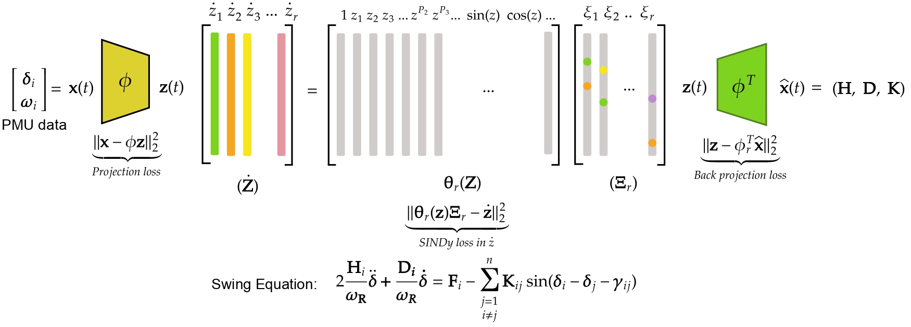

# Latent Sparse Identification of Nonlinear Dynamics (LSINDy)
## Lightweight SINDy workflows and case studies for power-system dynamic modelling, case studies, and benchmarking.  
Aiman Mushtaq, Danish Rafiq

---

This repository includes all MATLAB scripts used to reproduce the LSINDy results from _Discovering Power Grid Dynamics from Data Using Low-Rank Sparse Modeling_. All the figures are included in `figures`.
## 📁 Repository Structure

- case_study/
- src/
- figures/

**External requirements (required to run full case studies):**
- MAPTOWER — must be installed and accessible from your environment. [Link](https://matpower.org/)

> For any technical issues, feel free to contact danishrafiq32@gmail.com

## References
<a id="1">[1]</a> 
Nishikawa, T. and Motter, A.E., 2015. Comparative analysis of existing models for power-grid synchronization. New Journal of Physics, 17(1), p.015012.

<b id="2">[2]</b> 
Brunton, S.L., Proctor, J.L. and Kutz, J.N., 2016. Discovering governing equations from data by sparse identification of nonlinear dynamical systems. Proceedings of the national academy of sciences, 113(15), pp.3932-3937.
